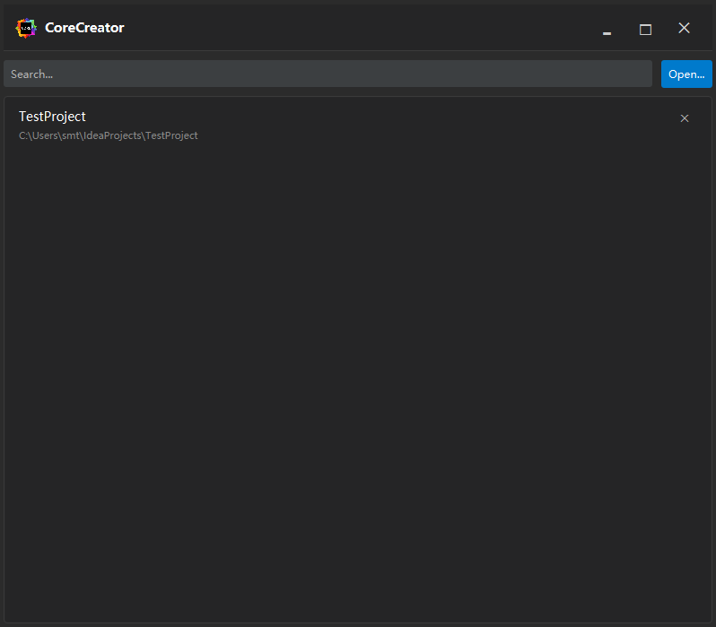
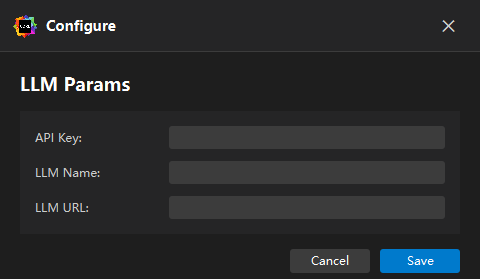
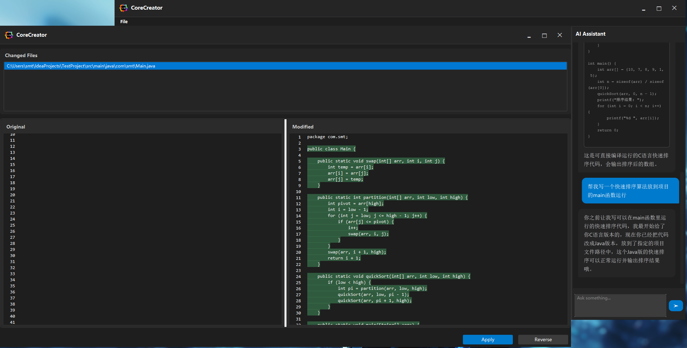

# 🌟 CoreCreator - AI 智能编辑器助手

<p align="center">
  
</p>

<p align="center">
  <a href="https://github.com/MellottStm/CoreCreator/releases/tag/release">
    
  </a>
  <a href="https://github.com/MellottStm/CoreCreator/blob/master/LICENSE">
    
  </a>
  <a>
    
  </a>
</p>

---

## ✨ 核心特性

- **🚀 全项目上下文理解** —— AI 真正理解整个代码库，而非单文件，支持几乎所有的文档理解，包括小说创作、文案编写等
- **💬 自然语言编程** —— 用中文/英文直接说需求，AI 自动实现
- **🔄 一键重构与优化** —— 代码优化、性能提升、架构调整
- **🌐 支持 100+ 种编程语言**（重点优化 Python、TypeScript、Go、Rust、Java 等）

## 🌴 项目构建
```bash

#1、构建
mvn clean package

#带控制台debug的
jpackage 
    --name CoreCreator 
    --icon "src\main\resources\Img\logo.ico" 
    --input "target" 
    --main-jar "CoreCreator-1.0-SNAPSHOT-fat.jar" 
    --main-class "com.smt.Main" 
    --module-path “你的openjfx的路径“ 
    --add-modules javafx.controls,javafx.web,java.logging,javafx.fxml,javafx.media,javafx.graphics,javafx.base,jdk.crypto.ec,java.sql
    --java-options "-Xmx2048m -Dfile.encoding=UTF-8 -Dhttps.protocols=TLSv1.2,TLSv1.3 -Djavax.net.debug=ssl:handshake" 
    --type msi 
    --vendor "smt" 
    --win-console 
    --win-shortcut 
    --win-menu 
    --win-dir-chooser 
    --win-per-user-install

#不带控制台的
jpackage 
    --name CoreCreator 
    --icon "src\main\resources\Img\logo.ico" 
    --input "target" --main-jar "CoreCreator-1.0-SNAPSHOT-fat.jar" 
    --main-class "com.smt.Main" 
    --module-path “你的openjfx的路径“  
    --add-modules javafx.controls,javafx.web,java.logging,javafx.fxml,javafx.media,javafx.graphics,javafx.base,jdk.crypto.ec,java.sql 
    --type msi 
    --vendor "smt" 
    --win-shortcut 
    --win-menu 
    --win-dir-chooser 
    --win-per-user-install

```


## 📸 运行预览
<p align="center">
  
</p>
<p align="center">
  
</p>
<p align="center">
  
</p>

---

## 🚀 快速开始

### 1. 下载安装

前往 [Release]("https://github.com/MellottStm/CoreCreator/releases/tag/release") 下载最新版本：

- **CoreCreator-1.0.0-windows**

### 2. 启动 CoreCreator

### 3. 打开项目

### 4.首次启动需要配置 API Key、Model Name、Base Url，国内外大模型都可以，软件性能受大模型基座影响。
